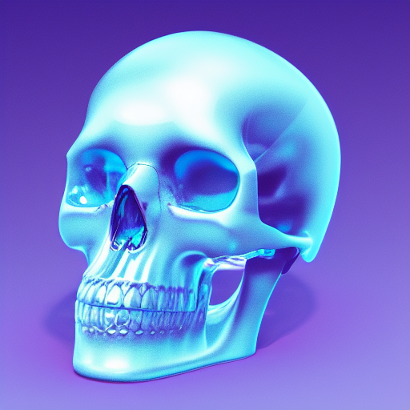

<!-- Improved compatibility of back to top link: See: https://github.com/othneildrew/Best-README-Template/pull/73 -->
<a name="readme-top"></a>
<!--
*** Thanks for checking out the Best-README-Template. If you have a suggestion
*** that would make this better, please fork the repo and create a pull request
*** or simply open an issue with the tag "enhancement".
*** Don't forget to give the project a star!
*** Thanks again! Now go create something AMAZING! :D
-->


<!-- PROJECT SHIELDS -->
<!--
*** I'm using markdown "reference style" links for readability.
*** Reference links are enclosed in brackets [ ] instead of parentheses ( ).
*** See the bottom of this document for the declaration of the reference variables
*** for contributors-url, forks-url, etc. This is an optional, concise syntax you may use.
*** https://www.markdownguide.org/basic-syntax/#reference-style-links
-->
[![Contributors][contributors-shield]][contributors-url]
[![Forks][forks-shield]][forks-url]
[![Stargazers][stars-shield]][stars-url]
[![Issues][issues-shield]][issues-url]
[![GPLv3 License][license-shield]][license-url]


<!-- PROJECT LOGO -->
<br />
<div align="center">
  <a href="https://github.com/AndreiMiculita/darkcold">
    
  </a>

<h3 align="center">DarkCold GTK2 & GTK3 theme</h3>

  <p align="center">
    DarkCold is a very y2k theme.
    <br />
    <a href="https://github.com/AndreiMiculita/darkcold"><strong>Explore the docs »</strong></a>
    <br />
    <br />
    <a href="https://github.com/AndreiMiculita/darkcold">View Demo</a>
    ·
    <a href="https://github.com/AndreiMiculita/darkcold/issues">Report Bug</a>
    ·
    <a href="https://github.com/AndreiMiculita/darkcold/issues">Request Feature</a>
  </p>
</div>


<!-- TABLE OF CONTENTS -->
<details>
  <summary>Table of Contents</summary>
  <ol>
    <li>
      <a href="#about-the-project">About The Project</a>
      <ul>
        <li><a href="#built-with">Built With</a></li>
      </ul>
    </li>
    <li>
      <a href="#getting-started">Getting Started</a>
      <ul>
        <li><a href="#prerequisites">Prerequisites</a></li>
        <li><a href="#installation">Installation</a></li>
      </ul>
    </li>
    <li><a href="#usage">Usage</a></li>
    <li><a href="#roadmap">Roadmap</a></li>
    <li><a href="#contributing">Contributing</a></li>
    <li><a href="#license">License</a></li>
    <li><a href="#contact">Contact</a></li>
    <li><a href="#acknowledgments">Acknowledgments</a></li>
  </ol>
</details>


<!-- ABOUT THE PROJECT -->
## About The Project

[![Product Name Screen Shot][product-screenshot1]](https://example.com)

DarkCold is a very y2k theme. Also on Gnome-look.org (but outdated):
http://gnome-look.org/content/show.php/DarkCold?content=143165


<p align="right">(<a href="#readme-top">back to top</a>)</p>

### Built With

* [![CSS][CSS]][CSS]

<p align="right">(<a href="#readme-top">back to top</a>)</p>


<!-- GETTING STARTED -->
## Getting Started

To use the theme follow these simple steps.

### Prerequisites

* GTK 3.20+

### Installation

1. Download the repo, or clone it:
   ```sh
   git clone https://github.com/AndreiMiculita/darkcold.git
   ```
2. Put it in your `~/.themes` directory
   ```sh
   mv darkcold ~/.themes
   ```
3. Activate it as a theme from your DE's settings.

For the Firefox theme:
```
    userContent.css -> ~/.mozilla/firefox/<bla_bla>/chrome 
```

<p align="right">(<a href="#readme-top">back to top</a>)</p>


<!-- USAGE EXAMPLES -->
## Usage
Some more screenshots:
[![Product Name Screen Shot][product-screenshot2]](https://example.com)
[![Product Name Screen Shot][product-screenshot3]](https://example.com)

<p align="right">(<a href="#readme-top">back to top</a>)</p>


<!-- ROADMAP -->
## Roadmap

There's no roadmap at the moment.

See the [open issues](https://github.com/AndreiMiculita/darkcold/issues) for a full list of proposed features (and known issues).

<p align="right">(<a href="#readme-top">back to top</a>)</p>


<!-- CONTRIBUTING -->
## Contributing

Contributions are what make the open source community such an amazing place to learn, inspire, and create. Any contributions you make are **greatly appreciated**.

If you have a suggestion that would make this better, please fork the repo and create a pull request. You can also simply open an issue with the tag "enhancement".
Don't forget to give the project a star! Thanks again!

1. Fork the project & clone it
2. Create your Feature Branch (`git checkout -b feature/AmazingFeature`)
3. Commit your changes (`git commit -m 'Add some AmazingFeature'`)
4. Push to the Branch (`git push origin feature/AmazingFeature`)
5. Open a Pull Request

<p align="right">(<a href="#readme-top">back to top</a>)</p>


<!-- LICENSE -->
## License

Distributed under the GPLv3 License. See `LICENSE` for more information.

<p align="right">(<a href="#readme-top">back to top</a>)</p>


<!-- CONTACT -->
## Contact

Andrei Miculita - [@andrei_miculita](https://twitter.com/andrei_miculita)

Project Link: [https://github.com/AndreiMiculita/darkcold](https://github.com/AndreiMiculita/darkcold)

<p align="right">(<a href="#readme-top">back to top</a>)</p>


<!-- ACKNOWLEDGMENTS -->
## Acknowledgments
* [OriginalSeed](https://github.com/originalseed) - the person who started this theme and has done 99% of the work.

<p align="right">(<a href="#readme-top">back to top</a>)</p>


<!-- MARKDOWN LINKS & IMAGES -->
<!-- https://www.markdownguide.org/basic-syntax/#reference-style-links -->

[contributors-shield]: https://img.shields.io/github/contributors/AndreiMiculita/darkcold.svg?style=for-the-badge
[contributors-url]: https://github.com/AndreiMiculita/darkcold/graphs/contributors
[forks-shield]: https://img.shields.io/github/forks/AndreiMiculita/darkcold.svg?style=for-the-badge
[forks-url]: https://github.com/AndreiMiculita/darkcold/network/members
[stars-shield]: https://img.shields.io/github/stars/AndreiMiculita/darkcold.svg?style=for-the-badge
[stars-url]: https://github.com/AndreiMiculita/darkcold/stargazers
[issues-shield]: https://img.shields.io/github/issues/AndreiMiculita/darkcold.svg?style=for-the-badge
[issues-url]: https://github.com/AndreiMiculita/darkcold/issues
[license-shield]: https://img.shields.io/github/license/AndreiMiculita/darkcold.svg?style=for-the-badge
[license-url]: https://github.com/AndreiMiculita/darkcold/blob/master/COPYING
[product-screenshot1]: https://user-images.githubusercontent.com/6352172/193411900-5e7f0929-8e3b-4f55-970e-8202143695a3.png
[product-screenshot2]: https://user-images.githubusercontent.com/6352172/193411910-0f987ee9-d63d-424d-8602-c76d30963cc2.png
[product-screenshot3]: https://user-images.githubusercontent.com/6352172/193411909-4b7c043f-2262-4301-be59-19ef1fcc6fb9.png
[CSS]: https://img.shields.io/badge/CSS-000000?style=for-the-badge&logo=css&logoColor=white
[Next-url]: https://css.org/]
